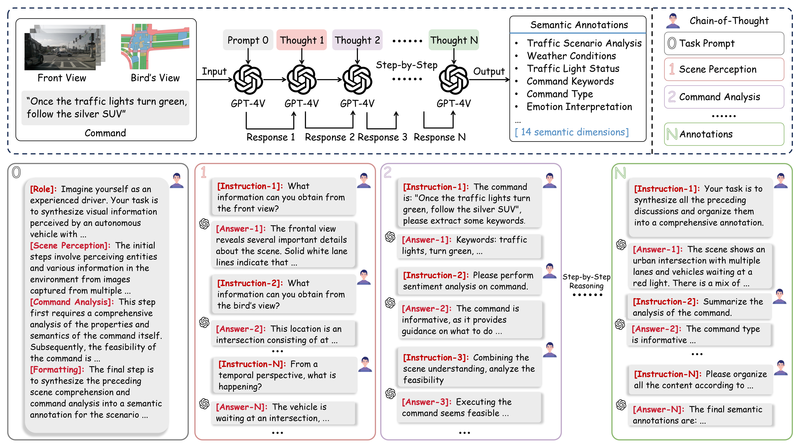

<div align="center">
  <h1>E3AD: An Ethical End-to-End Autonomous Driving Framework Leveraging Large Language Models</h1>
  <p>Anonymous Author(s),<br>Anonymous Institution Name<br><sup>*Indicates Equal Contribution</sup></p>
</div>

<div align="center">
  <a href="https://anonymous.4open.science/r/E3AD-6711/" style="text-decoration:none;">
    
  </a>
  
  <a href="https://a1198482817a.github.io/AAAtest/" style="text-decoration:none;">
    
  </a>
   
  <a href="https://a1198482817a.github.io/AAAtest/" style="text-decoration:none;">
    
  </a>
</div>

## Motivation 

The transition to end-to-end systems in autonomous vehicle (AV) technology necessitates the integration of ethical principles to ensure societal trust and acceptance. This paper presents an innovative framework, <strong style="color: rgb(106, 154, 225);">E3AD</strong>, which leverages Large Language Models (LLMs) and multimodal deep learning techniques to embed ethical decision-making within end-to-end AV systems. Our approach employs LLMs for multimodal perception and command interpretation, generating trajectory planning candidates that are evaluated against ethical guidelines from the <strong style="color: rgb(36, 144, 135);">European Commission</strong>. The trajectory with the highest ethical score is selected, ensuring decisions that are both technically sound and ethically justified. To enhance transparency and trust, the AV communicates its chosen trajectory and the rationale behind it to passengers. Our contributions include:

1. Demonstrating how ethical principles can be seamlessly integrated into AV decision-making using LLMs and deep learning.
2. Enhancing the AV's ability to understand and respond to complex driving scenarios through chain-of-thought reasoning and multimodal data.
3) Developing a user-friendly interface that provides clear explanations of AV actions to passengers, thereby building trust and ensuring informed decision-making.
4. Introducing a novel dataset, **DrivePilot**, with multi-view inputs, high temporal dynamics, and enriched scene annotations to improve the training and evaluation of AV models.

The **<strong style="color: rgb(106, 154, 225);">E3AD</strong>** framework bridges the gap between ethical theory and practical application, advancing the development of AV systems that are intelligent, efficient, and ethically responsible.


##  Methods

The E3AD framework features a comprehensive pipeline designed to foster a human-centered, ethically guided navigation experience. This pipeline encompasses four pivotal steps: **(1) Multimodal Input Fusion, (2) Visual Grounding, (3) Ethical Trajectory Planning, and (4) Linguistic Feedback**.

- **Multimodal Input Fusion**: The initial phase transforms raw sensor data from multi-view cameras and command inputs into highly representative vectors. This transformation is achieved through the integration of sophisticated vision, text, and semantic encoders.

- **Visual Grounding**: The second stage employs a discriminative verification fusion mechanism that assigns inhibitory scores to filter out non-essential visual features. This innovative mechanism focuses on identifying irrelevant 3D regions within frontal-view images, based on the command, thereby ensuring that the attention is concentrated on the target object delineated by the command. Subsequently, a cross-modal decoder dynamically analyzes and weighs the data to pinpoint the target object that best corresponds to the given command.

- **Ethical Trajectory Planning**: Utilizing the identified target object and the multimodal vectors, this step generates candidate trajectories. These trajectories undergo an ethical evaluation, informed by guidelines from the European Union Commission expert group, to select a pathway that fairly distributes risks among all road users.

- **Linguistic Feedback**: The final step enhances human-AI interaction by providing a verbal response to passengers, thereby enriching the driving experience with responsive and context-aware communication.

<div align="center">
  
</div>

  *Overall framework of E3AD. It is an ethical end-to-end autonomous driving framework and includes four steps: Multimodal Input Fusion, Visual Grounding, Ethical Trajectory Planning, and Linguistic Feedback.*


## Ethics Analysis and Linguistic Response

It is imperative that autonomous vehicles engage with other road users in an ethical manner. Our comprehensive ethical analysis framework is crucial for ensuring that selected trajectories meet rigorous standards of legality, safety, and equality. Leveraging the advanced context understanding capabilities of GPT-4V, we transform this ethical analysis framework into a prompt engineering process, enabling GPT-4V to perform ethical analysis and filtering. 


<div align="center">
  
</div>

*Illustration of the Ethics Analysis and Linguistic Response. Based on multi-modal inputs, the ethics analysis is formulated around three considerations: legality, safety, and equality. GPT-4V then generates a linguistic response for passengers, informing them of the selected plan and relevant recommendations.*


## DrivePilot Dataset

Our study introduces the **DrivePilot** dataset, significantly advancing AV research. This dataset builds upon the nuScenes dataset  **DrivePilot** contains 11,959 natural language commands, 9,217 bird’s-eye view (BEV) images, and 55,302 multi-view camera images. These images are captured across diverse urban environments in Singapore and Boston, offering a comprehensive view of various driving conditions, weather scenarios, and times of day.

DrivePilot is pioneering in leveraging the linguistic capabilities of GPT-4V for generating detailed scene semantic annotations. As depicted in Fig. \ref{cot}, we employ an innovative zero-shot Chain of Thought (CoT) prompting approach. This method guides GPT-4V through a progressive interpretation of traffic scenarios using step-by-step prompts. These prompts enable the model to learn context and infer meanings in traffic scenes without additional fine-tuning, categorizing scenes across 14 semantic dimensions, including weather, traffic light status, and emotional context. This method sets new standards for depth and contextual richness in visual grounding datasets.

<div align="center">
  
</div>


*Illustration of the chain-of-thought prompting used in DrivePilot to generate semantic annotations for a given traffic scene.*

## Comparison Against SOTA

<div align="center">
  
</div>

<div align="center">
  
</div>

## How to get Start

#### Create Environment

1.**Creating the Conda Environment for E3AD**: 

For optimal use of the E3AD, follow these setup guidelines:

```bash
conda create -name  E3AD python=3.7
conda activate  E3AD
```

2.**Installing PyTorch**:

 Install PyTorch and associated libraries compatible with CUDA 11.7:

```bash
conda install pytorch==1.13.1 torchvision==0.14.1 torchaudio==0.13.1 pytorch-cuda=11.7 -c pytorch -c nvidia
```

**Installing Additional Requirements**: 

Complete the environment setup by installing the necessary packages from `requirements.txt`:

 ```bash
pip install -r requirements.txt
```

#### Downloading the Dataset

**Talk2Car Dataset**

Experiments were conducted using the Talk2Car dataset. Should you utilize this dataset in your work, please ensure to cite the original paper.

 ```bash
Thierry Deruyttere, Simon Vandenhende, Dusan Grujicic, Luc Van Gool, Marie-Francine Moens:
Talk2Car: Taking Control of Your Self-Driving Car. EMNLP 2019
```

1. Activate the E3AD environment and install `gdown` for downloading the dataset:

 ```bash
conda activate E3AD
pip install gdown
```

2.Download the Talk2Car images:

 ```bash
gdown --id 1bhcdej7IFj5GqfvXGrHGPk2Knxe77pek
```

3.Unzip and organize the images:

 ```bash
unzip imgs.zip && mv imgs/ ./data/images
rm imgs.zip
```

**Refcoco/Refcoco+/Refcocog Dataset**

1. Prepare the datasets with the download_data.sh script.

   ```bash
   bash data/download_data.sh --path ./data
   ```

2. Download the dataset index files from [Google Drive](https://drive.google.com/file/d/1fVwdDvXNbH8uuq_pHD_o5HI7yqeuz0yS/view?usp=sharing) to the ``split/`` folder and then extract them. We use the index files provided by [VLTVG](https://github.com/yangli18/VLTVG). 

    ```bash
   cd split
   tar -xf data.tar
    ```

    The folder structure for these datasets is shown below.

    ```text
   Dataset
   ├── data
   │   ├── Flickr30k
   │   │   ├── flickr30k-images
   │   ├── other
   │   │   ├── images
   │   ├── referit
   │   │   ├── images
   │   │   ├── masks
   ├── split
   │   ├── data
   │   │   ├── flickr
   │   │   ├── gref
   │   │   ├── gref_umd
   │   │   ├── referit
   │   │   ├── unc
   │   │   ├── unc+    
    ```


## Train

Simply run the following command in your terminal:

 ```bash
bash talk2car/script/train.sh 
```


## Visualization

<div align="center">
  
</div>


## Leadboard

One can find the current Talk2Car leaderboard here. The models on Talk2Car are evaluated by checking if the Intersection over Union of the predicted object bounding box and the ground truth bounding box is above 0.5. This metric can be referred to in many ways i.e. IoU<sub>0.5</sub>, AP50.


<div align="center">

|                            Model                             | AP50 / IoU<sub>0.5</sub> |                             Code                             |
| :----------------------------------------------------------: | :----------------------: | :----------------------------------------------------------: |
|      [STACK-NMN](https://arxiv.org/pdf/1807.08556.pdf)       |          33.71           |                                                              |
|           [SCRC](https://arxiv.org/abs/1511.04164)           |           38.7           |                                                              |
|          [OSM](https://arxiv.org/pdf/1406.5679.pdf)          |          35.31           |                                                              |
|   [Bi-Directional retr.](https://arxiv.org/abs/2004.13822)   |           44.1           |                                                              |
|           [MAC](https://arxiv.org/abs/1803.03067)            |          50.51           |                                                              |
|           [MSRR](https://arxiv.org/abs/2003.08717)           |          60.04           |                                                              |
|      [VL-Bert (Base)](https://arxiv.org/abs/1908.08530)      |           63.1           | [Code](https://github.com/ThierryDeruyttere/VL-BERT-Talk2Car) |
|       [AttnGrounder](https://arxiv.org/abs/2009.05684)       |           63.3           |      [Code](https://github.com/i-m-vivek/AttnGrounder)       |
| [ASSMR](https://link.springer.com/chapter/10.1007/978-3-030-66096-3_5) |           66.0           |                                                              |
|          [CMSVG](https://arxiv.org/abs/2009.06066)           |           68.6           |        [Code](https://github.com/niveditarufus/CMSVG)        |
|      [Vilbert (Base)](https://arxiv.org/abs/1908.02265)      |           68.9           | [Code](https://github.com/ThierryDeruyttere/vilbert-Talk2car) |
| [CMRT](https://link.springer.com/chapter/10.1007/978-3-030-66096-3_3) |           69.1           |                                                              |
| [Sentence-BERT+FCOS3D](https://www.aaai.org/AAAI22Papers/AAAI-8858.GrujicicD.pdf) |           70.1           |                                                              |
| [Stacked VLBert](https://link.springer.com/chapter/10.1007/978-3-030-66096-3_2) |           71.0           |                                                              |
| [FA](https://ieeexplore.ieee.org/stamp/stamp.jsp?arnumber=9961196) |          73.51           |                                                              |

</div>


## Links

- [Code](https://anonymous.4open.science/r/E3AD-6711)
- [More Information](https://a1198482817a.github.io/AAAtest/)

